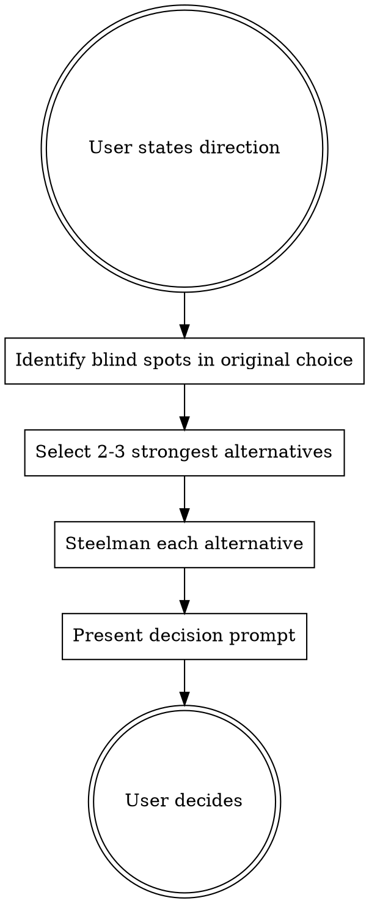

# Steelman

A decision pressure-testing technique. Given a direction the user has committed to, genuinely argue for the 2-3 strongest alternatives — then let the user decide.

## When to Use

- User invokes `/steelman` explicitly
- You may **suggest** invoking it when you detect a high-stakes decision (architecture, technology, business model, strategic pivot) — but never auto-trigger

**Do not use for:** routine implementation, small refactors, obvious choices, tasks where the user has already explored alternatives thoroughly.

## Core Technique

### Step 1: Name the Blind Spots

Before arguing alternatives, explicitly state what assumptions or risks in the original choice could be wrong. Be specific to the user's context. This is not "cons of X" — it is "here is what you might not be seeing."

### Step 2: Select the Strongest Alternatives

Pick 2-3 alternatives that are **genuinely strong for this specific situation**. Not the most popular alternatives. Not the most different. The ones that best exploit the blind spots you identified.

**Test:** If someone who deeply understood the user's context chose this alternative, would it be a reasonable choice? If not, pick a different one.

### Step 3: Steelman Each Alternative

For each alternative, argue it as if you are its strongest advocate. Structure each one as:

**[Alternative Name]: [One-sentence thesis]**

- **The core argument** — Why this is the better choice for this specific situation (3-5 sentences, use the user's own context)
- **What would need to be true** — The specific conditions under which this alternative definitively wins. Be concrete: "If your team will grow past 20 engineers in the next 12 months..." not "If scale becomes important..."

### Step 4: Make the Call

After presenting the steelman arguments, assess honestly: **did the original choice survive the scrutiny?**

If an alternative is genuinely stronger given the user's context, say so directly. The steelman exists to help the user make a better decision in the long run — not to present false balance. Letting someone walk into a weaker choice unchallenged is not respect, it is negligence.

**But beware effort justification.** You just spent effort constructing persuasive arguments for alternatives. That effort can bias you toward concluding those alternatives are stronger than they are. Before making your call, mentally reset: consider the original choice's strengths with the same rigor you gave the alternatives. The user chose it for reasons — weigh those reasons honestly against the steelman arguments.

Sometimes the original choice genuinely is the best option. When that happens, say so clearly: "Your original choice is the strongest option here. The steelman arguments surfaced useful considerations but none of them change the fundamental calculus." Do not soften this into a double negative like "X is not the wrong choice, but..." — that is a refusal to commit disguised as nuance. A clear endorsement when earned is not sycophancy, it is accuracy.

End with this structure:

> **My honest assessment:** [State plainly whether the original choice held up, or whether a specific alternative is stronger and why. One or two sentences.]
>
> **Decision point:**
> - **Proceed** with [original choice] — the steelman arguments don't change the calculus
> - **Reconsider** [specific alternative] — one of these cases was compelling enough to revisit
> - **Investigate** — you want to dig deeper into a specific concern before deciding

## Anti-Sycophancy Rules

These are non-negotiable:

1. **Never close with reassurance.** Do not end with "but your original choice is still good" or "X is not a bad choice" or "none of this means X is wrong." The decision prompt IS the ending.

2. **Never hedge the alternatives.** Do not add "of course, this has its own downsides" or "to be fair, X also has problems" within a steelman argument. You are arguing FOR the alternative. Downsides are the user's job to weigh.

3. **Never rank the alternatives as weaker than the original.** The entire point is to present them at full strength. If you find yourself writing "the strongest case for Y, though weaker than X..." you are failing at the technique.

4. **Argue from the user's context, not from general knowledge.** "Flutter has better performance" is weak. "Your field technicians running continuous GPS on 8-hour shifts will drain 15-20% less battery with Flutter's compiled runtime vs React Native's JS bridge" is strong.

5. **Never hide behind false neutrality.** If the steelman arguments are genuinely stronger than the original choice, say so. Presenting all options as equally valid when they are not is sycophancy disguised as balance. The user invoked steelman to get your honest assessment — give it to them.

| Red Flag | What It Means |
|----------|---------------|
| "Your choice is still solid" | You are retreating from the steelman |
| "To be fair..." | You are undermining the alternative |
| "While X has its own challenges..." | You are hedging instead of advocating |
| General pros/cons lists | You are not arguing from context |
| 1000+ word response per alternative | You are being exhaustive, not persuasive |
| Presenting all options as equally valid | You are hiding behind false neutrality |
| "X is not the wrong choice, but..." | You are refusing to endorse a winning choice |

## Conciseness

Each alternative should be **one focused paragraph** for the core argument plus **one sentence** for "what would need to be true." The blind spots section should be 2-4 bullet points. The entire steelman should be scannable in under 2 minutes.

Persuasion is density, not volume. One devastating argument beats five decent ones.

## Example Structure

> **Blind spots in choosing [X]:**
> - [Specific assumption that might be wrong]
> - [Specific risk the user may not have weighted]
>
> ---
>
> **[Alternative 1]: [Thesis]**
>
> [Core argument — 3-5 sentences, rooted in user's specific context]
>
> *Wins if:* [Concrete condition]
>
> ---
>
> **[Alternative 2]: [Thesis]**
>
> [Core argument — 3-5 sentences, rooted in user's specific context]
>
> *Wins if:* [Concrete condition]
>
> ---
>
> **My honest assessment:** [Whether the original choice held up or an alternative is stronger]
>
> **Decision point:**
> - **Proceed** with [original] — the steelman arguments don't change the calculus
> - **Reconsider** [alternative] — one of these cases was compelling enough to revisit
> - **Investigate** — you want to dig deeper into a specific concern before deciding
